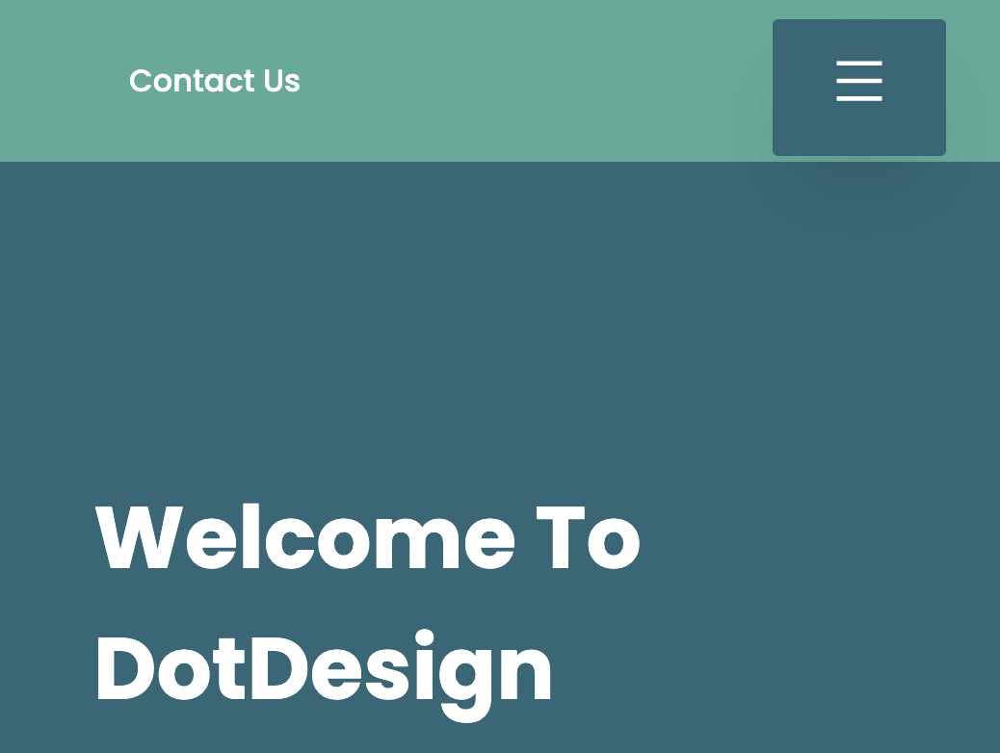

# Project Brief

Our Project is a UI/UX Design Website. The main goal of the dotdesign is to offer our services to clients who need to build application/website that are user-friendly. Our portfolios are linked to showcase our skillsets.


## Built with
- [ReactJs](https://reactjs.org/)
- [Material UI](https://mui.com/)

# Getting Started
## How to install
  
1. Clone Github repository
    ```
    git clone https://github.com/Jessy-G26/dotDesign.git
    ```
2. Install npm dependencies
    ```
    npm install
    ```
3. To run the application

    ```
    npm start
    ```
4. Visit http://localhost:3000 to view it in your browser.

## Codebase File Structure
### Root Folder Structure


### Source Folder Structure


### Folder Structure

`src/components` - contains the pages of the project
* about
    
* Contacts
    
* footer - used MUI Box, Container, and Link to format. Added hover effect using css.
    
* heading
    
    
* home
    
* icons
    
* pricing
    
* projects
    
* services
    
* teams
     
* testimonials
    

`src/img` - contains images used in the project


